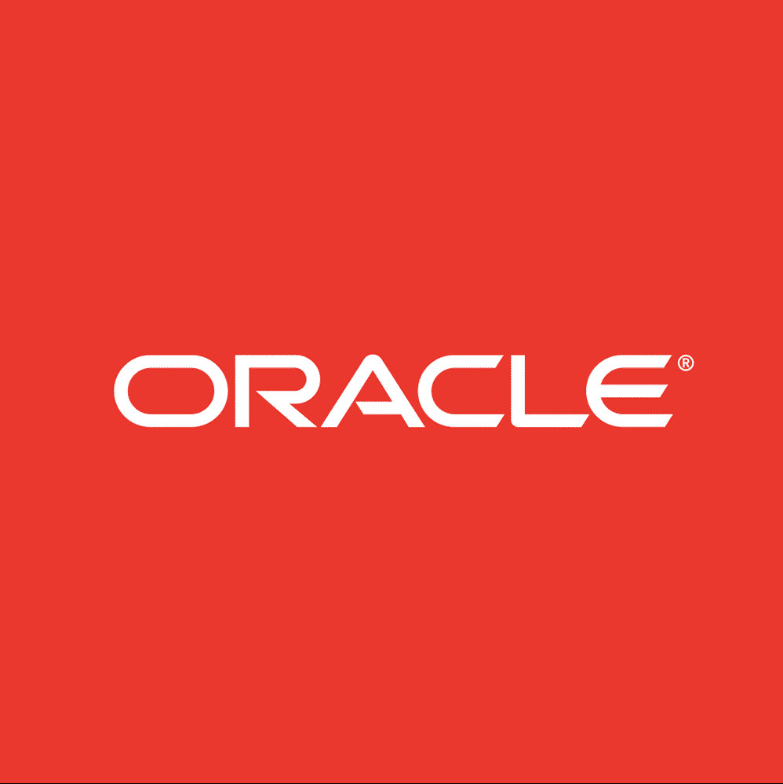

<ul class="work">
    <li>
        

            
            

                <h2>Oracle</h2>
                <h3>Principal Software Engineer</h3>
                <h4>August 2020 - Present</h4>
            

        

        

            

                I work on the data management team for
                <a href="https://www.netsuite.com" target="_blank">NetSuite</a>, developing
                internal services and automation to manage the cloud infrastructure and databases behind
                NetSuite. I make sure customer data is always available!
            

            

                Technologies used: Java 11, IntelliJ, Gradle, Git, Dropwizard, Docker, Kubernetes,
                Oracle Database, Bash, macOS, Windows, Linux
            

        

    </li>
    <li>
        

            
            

                <h2>Parsons</h2>
                <h3>Software Engineer</h3>
                <h4>September 2015 - August 2020</h4>
            

        

        

            

                Collaborated with back-end & front-end engineers and subject-matter experts to modernize
                mission planning software from legacy desktop applications into Spring Boot & Angular-based
                microservices web applications, developed from the ground-up.
            

            

                Technologies used: Java 8, IntelliJ, Spring Boot, Ant, Maven, PostgreSQL, JavaFX, Swing, OSGi,
                Git, SVN, Docker, Bash, Cloud Foundry, Concourse, Hibernate, Windows, Linux
            

        

    </li>
</ul>
