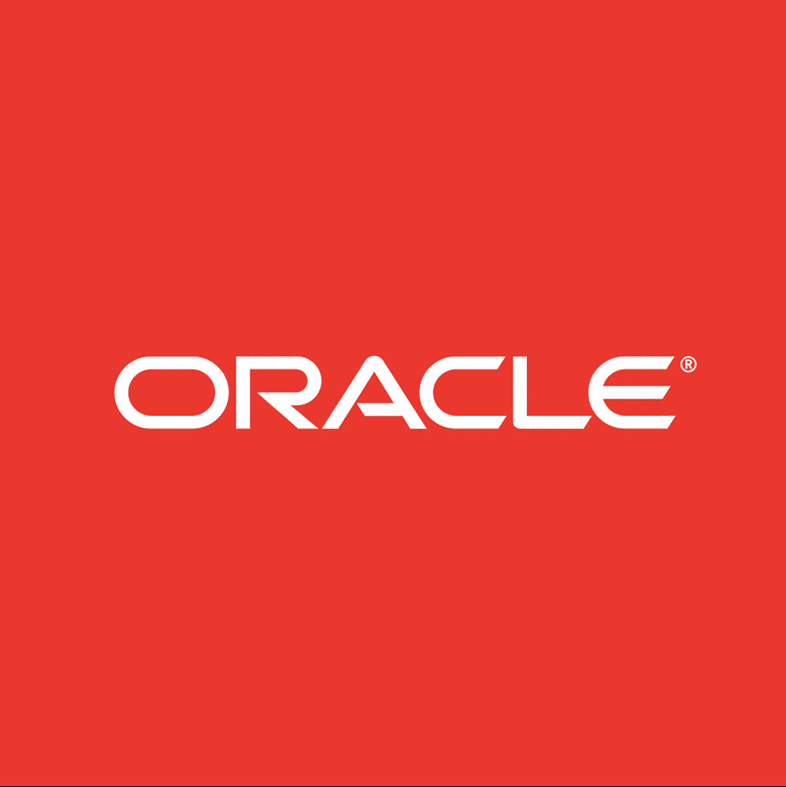
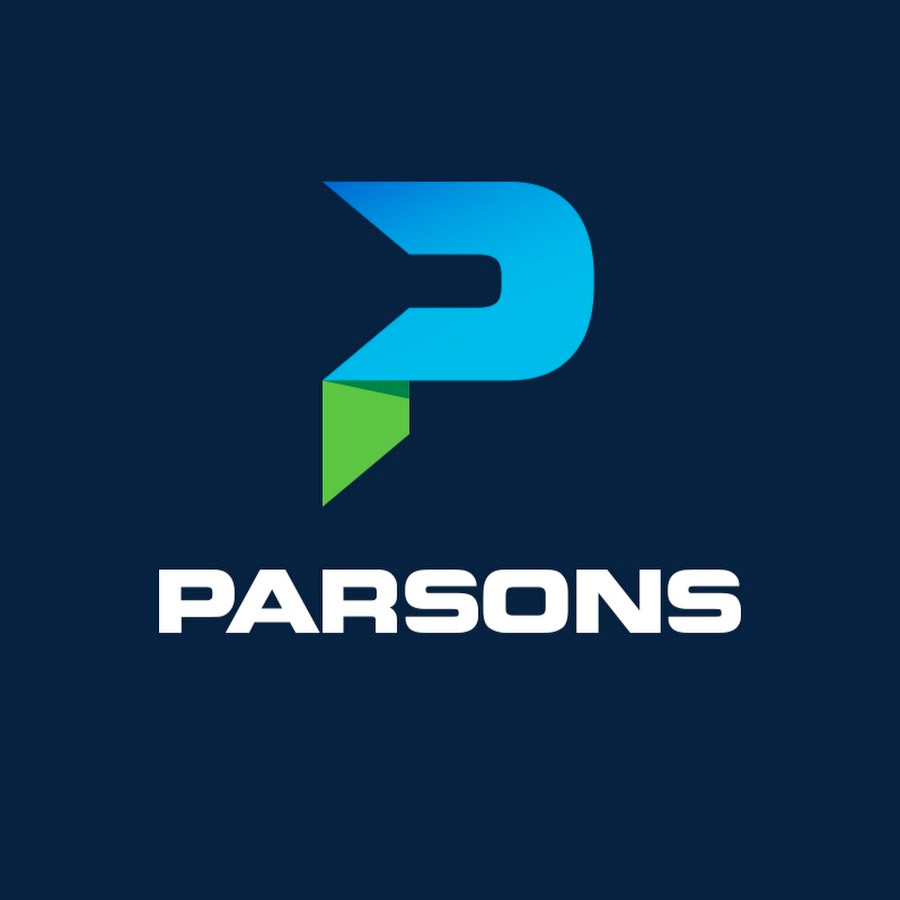

<ul class="work">
    <li>
        

            
            

                <h2>Oracle</h2>
                <h3>Principal Software Engineer</h3>
                <h4>August 2020 - March 2026</h4>
            

        

        

            

                Developed internal Java services and automation to manage cloud infrastructure and database operations
                behind NetSuite, improving service reliability and reducing manual overhead for supporting teams.
            

            

                Owned
                end-to-end design and implementation of new SSH key management system for internal controllers and
                system administrators, enabling secure, auditable access to NetSuite’s infrastructure and timely
                credential rotation.
            

            

                Spearheaded team-wide code quality initiative by creating code style standards,
                integrating build plugins, and introducing new code frameworks to reduce technical debt.
            

        

    </li>
    <li>
        

            
            

                <h2>Parsons</h2>
                <h3>Software Engineer</h3>
                <h4>September 2015 - August 2020</h4>
            

        

        

            

                Collaborated with backend & frontend engineers and subject-matter experts to modernize mission planning
                software from legacy desktop applications into Spring Boot & Angular-based microservices web
                applications, developed from the ground-up. Maintained those legacy desktop applications.
            

        

    </li>
</ul>
